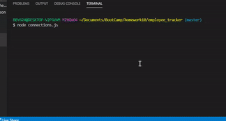

# employee_tracker

### Description

An app for managing a company's employees using node, inquirer, and MySQL.

The command-line application allow users to: 

Add departments, roles, employees,  
View departments, roles, employees  
Update employee roles 

*Key words* : 
*SQL*, *MySql*, *Node.js* 

### Installation
In your terminal type: git clone https://github.com/cibellem/employee_tracker.git  
Open in Visual Studio to build and run.

### User Story

### Demo

  

